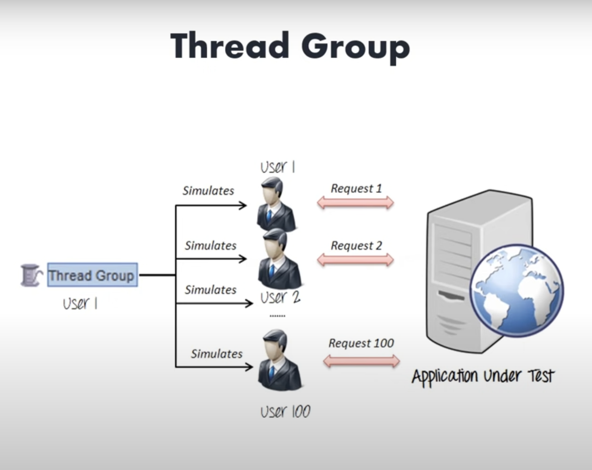
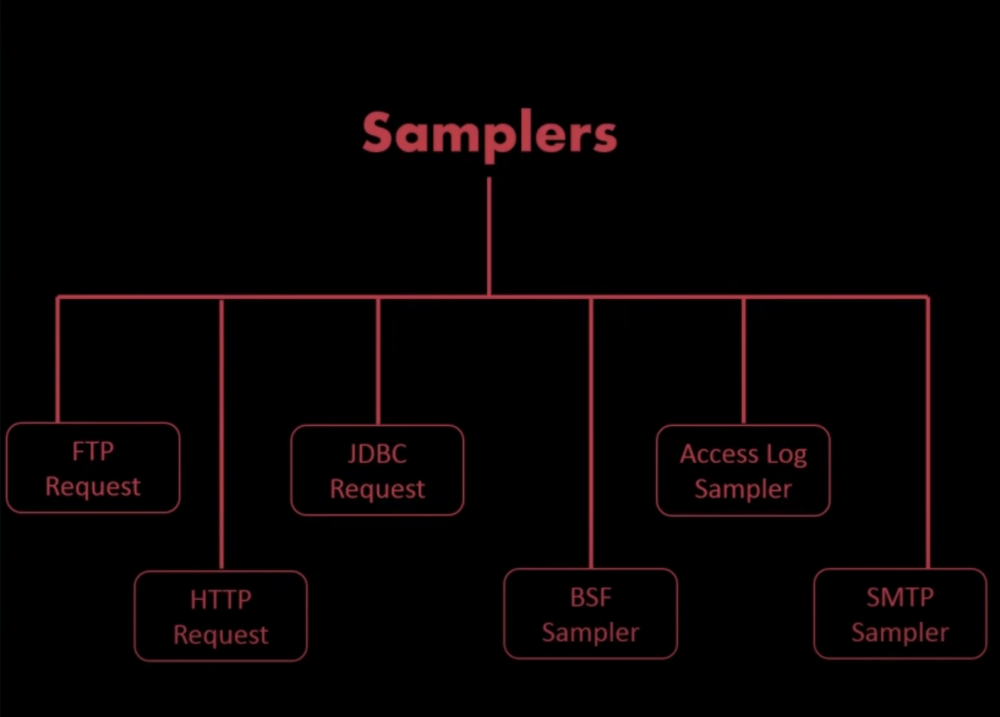
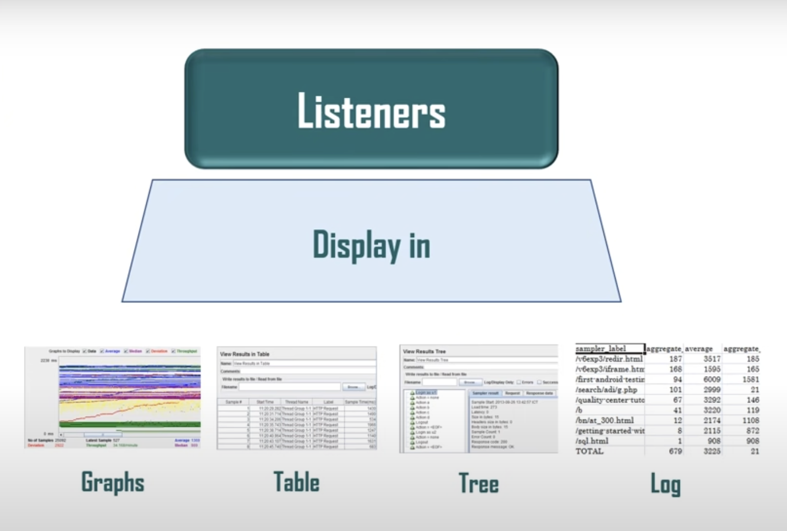
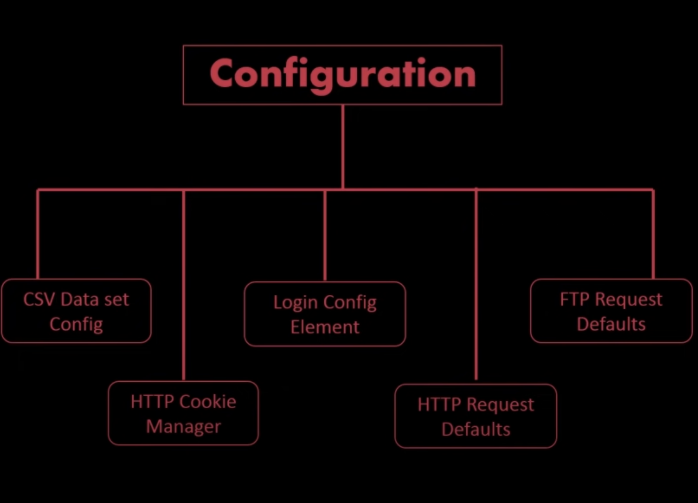

# Selenium-Load-Test-with-JMeter

To perform a Selenium load test with JMeter, you can use the WebDriver Sampler plugin. Here's a step-by-step guide on how to set it up:

1. **Install JMeter**: If you haven't already, download and install Apache JMeter from the official website.
2. **Install WebDriver Sampler**: Download the WebDriver Sampler plugin from the JMeter Plugins Manager. You can do this by opening JMeter, going to Options -> Plugins Manager, and then selecting and installing the WebDriver Sampler.
3. **Set Up WebDriver Config**: Add a WebDriver Config element to your test plan. Configure it according to your requirements, specifying the browser (e.g., Chrome, Firefox), the path to the browser executable (if necessary), and other settings.
4. **Record Your Selenium Script**: You can record your Selenium script using the JMeter Chrome/Firefox browser extension. Alternatively, you can manually write your Selenium script using Java or any other supported language.
5. **Add WebDriver Sampler**: Add a WebDriver Sampler to your test plan. In this sampler, you can either paste the recorded Selenium script or write your Selenium code directly.
6. **Parameterize Your Test**: If you want to parameterize your test (e.g., to simulate multiple users), you can use JMeter variables or CSV data files.
7. **Configure Thread Group**: Add a Thread Group to your test plan and configure the number of threads (virtual users), ramp-up period, and loop count according to your load testing requirements.
8. **Run Your Test**: Once you have configured everything, you can run your test by clicking the green play button in JMeter. You'll be able to monitor the performance of your web application under load.
9. **Analyze Results**: After the test has run, you can analyze the results using JMeter's built-in listeners or by exporting the results to a file for further analysis.

Remember to carefully configure your test plan and consider the resources required for running multiple browser instances simultaneously. Also, ensure that your test environment can handle the load generated by your Selenium tests.

## 1. What is Load Testing ?

**=>** Load testing is a type of performance testing that assesses how a system behaves under a specific load. The goal of load testing is to determine whether a system can handle the expected amount of users, transactions, or data volume within acceptable performance criteria.

In load testing, the system is subjected to increasing levels of load (such as concurrent users, transactions per second, or data throughput) to evaluate its response time, throughput, resource utilization, and stability under various conditions. Load testing helps identify performance bottlenecks, scalability issues, and potential points of failure in a system.

Key aspects of load testing include:

1. **Performance Metrics**: Load testing measures various performance metrics such as response time (the time taken for the system to respond to a request), throughput (the number of transactions processed per unit of time), and error rates under different load levels.
2. **Scalability Testing**: Load testing helps assess how well a system scales as the load increases. It helps determine whether the system can handle additional users or data without a significant degradation in performance.
3. **Stress Testing**: Load testing often includes stress testing, where the system is pushed beyond its normal operating capacity to identify its breaking point or the maximum load it can handle before experiencing critical failures.
4. **Resource Utilization**: Load testing monitors the utilization of system resources such as CPU, memory, disk I/O, and network bandwidth to identify any resource constraints that may affect performance under load.
5. **Endurance Testing**: Endurance testing, a type of load testing, involves running the system under a sustained load for an extended period to assess its stability and reliability over time.

Load testing is crucial for ensuring the performance, reliability, and scalability of software applications, websites, APIs, and other systems, especially in environments where high availability and responsiveness are critical requirements. It helps organizations identify performance issues early in the development lifecycle and optimize their systems to meet user expectations and business needs.

## 2. Different tool avilable for load testing ?

**=>** There are several tools available for load testing, each with its own features, strengths, and limitations. Here are some popular load testing tools:

1. **Apache JMeter**: Apache JMeter is an open-source Java-based tool that is widely used for load testing web applications, APIs, and other services. It supports various protocols such as HTTP, HTTPS, FTP, JDBC, SOAP, and more. JMeter offers a user-friendly GUI for test creation and can be extended with plugins for additional functionality.
2. **LoadRunner**: LoadRunner, developed by Micro Focus, is a commercial load testing tool that supports a wide range of protocols including HTTP, HTTPS, WebSockets, SAP, Oracle Forms, and more. It offers a variety of features for performance testing, including load generation, scenario creation, monitoring, and analysis.
3. **Gatling**: Gatling is an open-source load testing tool written in Scala. It is designed for ease of use, scalability, and high performance. Gatling scripts are written in a DSL (Domain-Specific Language) that is easy to learn and understand. Gatling supports HTTP, WebSockets, JMS, JDBC, and other protocols.
4. **BlazeMeter**: BlazeMeter is a commercial load testing platform that offers both cloud-based and on-premises solutions. It supports JMeter scripts and provides additional features such as real-time reporting, integration with CI/CD tools, and distributed testing capabilities.
5. **Artillery**: Artillery is an open-source load testing tool that is designed for testing modern web applications and microservices. It offers a flexible YAML-based scripting language and supports HTTP, WebSocket, and Socket.io protocols. Artillery can be used for both load testing and functional testing.
6. **Locust**: Locust is an open-source load testing tool written in Python. It allows you to write test scenarios using Python code, making it easy to customize and extend. Locust supports HTTP, WebSocket, and other protocols and is suitable for testing web applications, APIs, and other services.
7. **Tsung**: Tsung is an open-source distributed load testing tool written in Erlang. It supports HTTP, HTTPS, WebDAV, SOAP, and other protocols. Tsung is designed for scalability and can simulate thousands of virtual users from multiple machines.

These are just a few examples of load testing tools available in the market. When choosing a load testing tool, consider factors such as protocol support, ease of use, scalability, reporting capabilities, and your specific testing requirements.

## 3. What is JMeter ?

**=>** Apache JMeter is an open-source Java-based software application designed to load test functional behavior and measure performance. It is widely used for testing the performance of web applications, web services, APIs, and various other types of software. JMeter is maintained by the Apache Software Foundation and is freely available under the Apache License 2.0.

Here are some key features of JMeter:

1. **Protocol Support**: JMeter supports testing of various protocols including HTTP, HTTPS, FTP, JDBC, SOAP, REST, JMS, LDAP, TCP, and more. This makes it versatile for testing different types of applications and services.
2. **User-friendly GUI**: JMeter provides a user-friendly graphical user interface (GUI) for creating and configuring test plans. Test plans consist of multiple elements such as Thread Groups, Samplers, Logic Controllers, Timers, Assertions, and Listeners, which can be added and configured using the GUI.
3. **Scripting and Recording**: JMeter allows users to create test scripts either manually or by recording interactions with a web application using the built-in HTTP(S) Test Script Recorder. This makes it easy to simulate user behavior and interactions with the application under test.
4. **Parameterization and Data-Driven Testing**: JMeter supports parameterization and data-driven testing, allowing users to parameterize test scenarios with variables and use CSV files or databases to supply test data.
5. **Assertions and Validation**: JMeter provides various assertions to validate server responses and ensure that the application is behaving as expected. Assertions can be used to check response codes, response content, response times, and more.
6. **Load Generation and Distribution**: JMeter can simulate a large number of virtual users (threads) to generate load on the application under test. It supports distributed testing, allowing multiple JMeter instances to be coordinated to generate higher loads from multiple machines.
7. **Reporting and Analysis**: JMeter provides various listeners (reporting components) to monitor and analyze test results in real-time or after the test has been completed. These include graphical and tabular representations of response times, throughput, error rates, and other performance metrics.

Overall, JMeter is a powerful and flexible tool for load testing and performance testing, suitable for both simple and complex testing scenarios. Its open-source nature, extensive documentation, and active community make it a popular choice for performance testing professionals worldwide.

## 4. Why use JMeter for load testing ?

**=>** There are several reasons why JMeter is a popular choice for load testing:

1. **Open Source**: JMeter is open-source software, which means it is freely available to download, use, and modify. This makes it accessible to individuals and organizations of all sizes, without the need for expensive licensing fees.
2. **Versatility**: JMeter supports a wide range of protocols including HTTP, HTTPS, FTP, JDBC, SOAP, REST, JMS, LDAP, TCP, and more. This versatility allows it to be used for load testing a variety of applications, web services, and APIs.
3. **User-Friendly GUI**: JMeter provides a user-friendly graphical user interface (GUI) for creating and configuring test plans. The GUI allows users to easily add, configure, and organize test elements such as Thread Groups, Samplers, Logic Controllers, Assertions, and Listeners.
4. **Scripting and Recording**: JMeter allows users to create test scripts either manually or by recording interactions with a web application using the built-in HTTP(S) Test Script Recorder. This makes it easy to simulate user behavior and interactions with the application under test.
5. **Parameterization and Data-Driven Testing**: JMeter supports parameterization and data-driven testing, allowing users to parameterize test scenarios with variables and use CSV files or databases to supply test data. This enables testing with a variety of input data and scenarios.
6. **Load Generation and Distribution**: JMeter can simulate a large number of virtual users (threads) to generate load on the application under test. It supports distributed testing, allowing multiple JMeter instances to be coordinated to generate higher loads from multiple machines.
7. **Reporting and Analysis**: JMeter provides various listeners (reporting components) to monitor and analyze test results in real-time or after the test has been completed. These include graphical and tabular representations of response times, throughput, error rates, and other performance metrics.
8. **Active Community and Support**: JMeter has a large and active community of users and contributors who provide support, documentation, tutorials, and plugins/extensions. This community-driven ecosystem ensures that users have access to resources and assistance when needed.

Overall, JMeter's combination of features, ease of use, versatility, and community support make it a popular choice for load testing and performance testing of web applications, web services, APIs, and other software systems.

## 5. Elements of JMeter ?

**=>** In JMeter, a test plan consists of various elements that are used to create and configure the load testing scenarios. Here are some of the key elements commonly used in a JMeter test plan:

1. **Thread Group**: The Thread Group is the starting point of a test plan. It represents a group of virtual users (threads) that will execute the test scenarios defined within it. The Thread Group defines the number of threads (users), ramp-up period, and loop count.
2. **Controllers**:

   - **Samplers**: Samplers are the actual requests sent to the server under test. They simulate user interactions by making requests to the server using various protocols such as HTTP, FTP, JDBC, SOAP, etc.
   - **Logic Controllers**: Logic Controllers determine the order and repetition of execution of samplers and other elements within the test plan. Examples include:
     - **Loop Controller**: Repeats the execution of its child elements a specified number of times.
     - **Transaction Controller**: Groups samplers into logical transactions, allowing them to be measured as a single entity.
     - **If Controller**: Executes its child elements based on a condition.
     - **Random Controller**: Executes one of its child elements randomly.
3. **Listeners**: Listeners are used to view and analyze the test results. They display information such as response times, throughput, error rates, and more in graphical or tabular format. Examples include:

   - **View Results Tree**: Displays the results of each sampler in a tree format.
   - **Summary Report**: Provides a summary of the test results including throughput, response times, and error counts.
   - **Graph Results**: Displays test results in a graphical chart.
4. **Timers**: Timers are used to introduce delays between requests, simulating think time or pacing. This helps simulate realistic user behavior and distribute the load more evenly. Examples include:

   - **Constant Timer**: Adds a constant delay between requests.
   - **Gaussian Random Timer**: Adds random delays following a Gaussian distribution.
   - **Uniform Random Timer**: Adds random delays within a specified range.
5. **Assertions**: Assertions are used to validate the responses received from the server under test. They verify that the response meets certain criteria such as response code, response data, or response time. Examples include:

   - **Response Assertion**: Checks if the response contains a particular text or matches a regular expression.
   - **Duration Assertion**: Checks if the response time falls within a specified range.
6. **Configuration Elements**: Configuration elements are used to configure the behavior of samplers and other elements within the test plan. Examples include:

   - **HTTP Request Defaults**: Sets default values for HTTP requests such as server name, protocol, and port number.
   - **CSV Data Set Config**: Reads data from CSV files and provides values to samplers during test execution.
   - **User Defined Variables**: Defines custom variables that can be referenced within the test plan.

These are some of the fundamental elements of a JMeter test plan. By combining these elements, you can create complex and realistic load testing scenarios to evaluate the performance of your applications and systems.

## 6. JMeter Load Testing and Performance Testing ?

**=>** JMeter is a versatile tool that can be used for both load testing and performance testing of software applications, web services, APIs, and other systems. Let's explore how JMeter can be utilized for each of these purposes:

1. **Load Testing**:

   - **Simulating Concurrent Users**: JMeter allows you to simulate a large number of virtual users (threads) concurrently accessing your application. You can configure the number of threads, ramp-up period, and loop count in the Thread Group to simulate various load scenarios.
   - **Generating Load on the Server**: With JMeter's samplers, you can send requests to your server under test using various protocols such as HTTP, HTTPS, FTP, JDBC, SOAP, REST, and more. These requests simulate user interactions and generate load on the server.
   - **Monitoring Server Performance**: JMeter's listeners provide real-time monitoring of server performance metrics such as response times, throughput, error rates, and resource utilization. This helps identify performance bottlenecks and areas for optimization under load.
2. **Performance Testing**:

   - **Measuring Response Times**: JMeter measures the response times of requests sent to the server under test. This allows you to evaluate the performance of your application and identify slow or poorly performing components.
   - **Analyzing Throughput**: Throughput represents the number of requests processed by the server per unit of time. JMeter's listeners provide metrics on throughput, allowing you to assess the system's capacity to handle concurrent requests.
   - **Identifying Performance Bottlenecks**: By analyzing JMeter's test results, you can pinpoint performance bottlenecks in your application such as slow database queries, inefficient code, network latency, or server configuration issues.
   - **Stress Testing**: JMeter can be used to perform stress testing by gradually increasing the load on the server until it reaches its breaking point. This helps determine the maximum capacity and scalability of the system.

Overall, JMeter provides a comprehensive set of features for both load testing and performance testing, enabling you to evaluate the behavior and performance of your applications under various load conditions. By leveraging JMeter's capabilities, you can ensure that your applications meet performance requirements, deliver a positive user experience, and perform optimally under peak loads.
